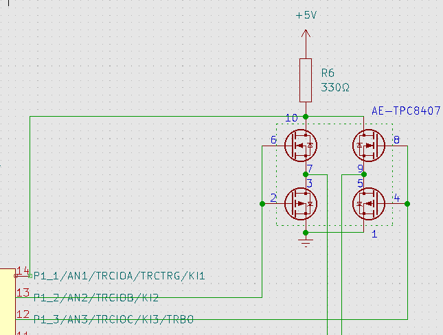
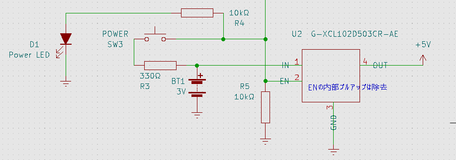
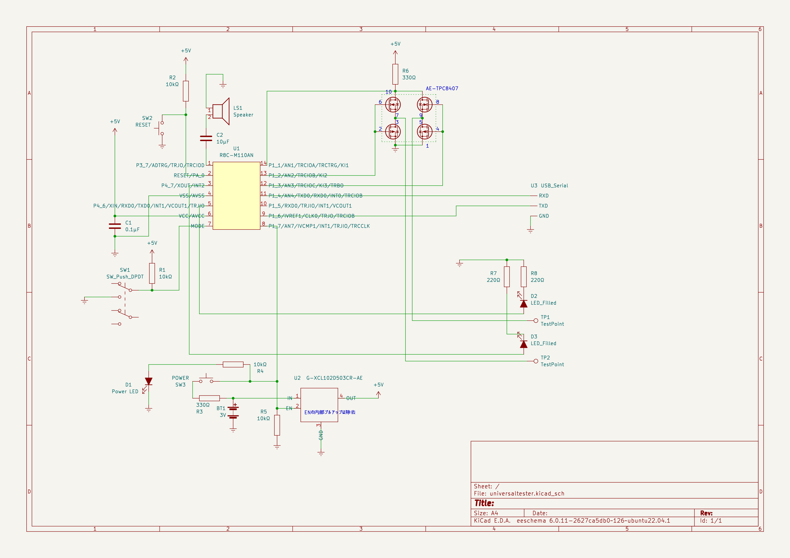

# 万能導通テスタ

回路製作では良く導通テスタを使用する。市販のテスタにも導通テスタ機能が付いているものが多い。これは導通していればブザが鳴るものがほとんどだ。しかし少々使い辛いので自分で作ることにした。

## 一般的なテスタの導通テスタ機能

一般的なテスタに用意されている導通テスタ機能で不便な点は以下の動画にまとめた。

<iframe width="560" height="315" src="https://www.youtube.com/embed/wsYs5_lycps" title="YouTube video player" frameborder="0" allow="accelerometer; autoplay; clipboard-write; encrypted-media; gyroscope; picture-in-picture; web-share" allowfullscreen></iframe>

デジタルテスタには微妙なタイムラグがある。おそらく今もアナログテスタに拘っている人達の理由の1つは、このタイムラグかもしれない。1-2回の測定ならともかく、何度も測定する場合はこのタイムラグが微妙にストレスになってくる。

導通テスタは、ある程度の抵抗があると反応しない。もちろん「導通」の試験なのだからこれ自体は正しい。しかしテスタ棒の接触不良のせいなのか、実際に導通していないのかが判別できない。さきほどのタイムラグと相俟ってこれもストレスとなる。

そしてダイオード、LEDのテスト。通常は導通テストとは別にダイオードテストのモードがあり、そこに切り替えないといけない。そして極性は自分で合わせないといけないので、自分でテスタ棒を入れ替えて調べる必要があり面倒だ。

## 今回製作した導通テスタ

今回製作した導通テスタの動作も動画にした。

<iframe width="560" height="315" src="https://www.youtube.com/embed/jaog9l4Jh-w" title="YouTube video player" frameborder="0" allow="accelerometer; autoplay; clipboard-write; encrypted-media; gyroscope; picture-in-picture; web-share" allowfullscreen></iframe>

電源onはボタンを押すだけですぐに起動。導通テストのタイムラグは数10ms程度で、すぐに反応する。導通していれば音に加えてテスタ棒が光ることで分かる。抵抗がある場合は音程が変わるので完全導通じゃない場合も分かるし、ちょっとしたテスタ棒の接触不良でも音がすぐに鳴って分かる。LED、ダイオードの場合は自動的に極性を検出してアノード側のテスタ棒のみが光るので、テスタ棒を自分で入れ替えたりしなくて良い。

## 機能

欲しかった機能はざっとこんな感じ。

* すぐに起動すること
* 測定のタイムラグが小さいこと
* 抵抗値によってブザの音程が変わること
* ダイオードを一発でテストできること
* LEDの場合は点灯すること(透明なタイプのLEDで発光色を確認したい時があるので)
* オートパワーオフ
* 電池駆動(できればニッケル水素電池2本くらいで稼働して欲しい)

## マイクロコントローラ

機能的に必要なのは、

* I/O(LEDの制御など)
* AD変換(抵抗値によって音程を変えたいので)
* PWM(ブザ)
* UART(デバッグ用にあると助かる。無くても良い)
* 5V駆動(LEDを点灯させるにはI/Oが4Vくらい出力できないと難しい)

くらいでパフォーマンスは不要。PIC16Fあたりで十分と思われる。ところが昨今の半導体不足の影響か結構値段が上がっており、むしろPIC24やPIC32の方が安かったりする。ただこちらは電源が3.3Vになってしまうので条件を満たさなくなってしまう。PIC以外を物色していたら良いものが見つかった。[R8C(M110AN)](https://akizukidenshi.com/catalog/g/gI-04524/)である。廃品種なので仕事で使うのは無理だが趣味で使うなら問題無し。10個入りで500円だ。ピン数が多い[R8C(M120AN)](https://akizukidenshi.com/catalog/g/gI-04525/)もあり、ソフトウェア的にはコンパチでI/Oが多いだけなので扱い易い。この値段で16bitコアだし高速クロック発振器も内蔵されていて外付け回路不要だ。電源範囲も広いし20MHz動作でも数mAしか消費しないので扱い易い。目立った欠点はI2Cに対応していないことくらいか。また隠しRAM/ROMがあるようで、実際にはRAMは1366バイト(公称値256バイト)、ROMは64Kバイト(公称値2Kバイト)利用可能のようだ。

## 開発環境

廃品種となると開発環境が不安だが、[hirakuni45さんのGitHub Page](https://github.com/hirakuni45/R8C)に素晴しい内容が公開されている。ただ少々GCCが古く、C++のenum classをビットフィールドに使えないバグがあって辛かったため、GCC 12をdocker環境に[移植してみた](https://github.com/r8c-m1x0a/docker-devenv)。

GCC 12環境用に以下のものを用意。

* [R8Cのスタートアップファイルなど](https://github.com/r8c-m1x0a/r8c)
* [I/Oアクセス用ライブラリ](https://github.com/r8c-m1x0a/io)

プログラマは、上記のhirakuni45さんのページにあるものを使用。.motというファイルがビルドできれば良い。書き込み方法もhirakuni45さんのページに記載されている。

R8Cは消費電力が小さいので、USB serialに付いている5Vで十分駆動できた。

## ダイオードの自動測定

ダイオードの自動測定には定期的にテスタ棒にかける電圧の正負を反転してやって、その時に流れる電流が片方にしか流れていないかを調べれば良い。すぐ思い付くのはマイコンのI/O端子2つを使って、その2つを5V/0V、0V/5Vに切り替えるという方法。今回は若干オーバースペックなのだけど、[MOS-FETのブリッジ](https://akizukidenshi.com/catalog/g/gK-11338/)を使用した。

PIN10と電源の間に抵抗を入れて、ここの電位をA/D変換で測定する。何も測定していない時は電流0なので、ほぼ5Vとなり、何か接続していれば流れている電流に応じた電圧降下分電位が下がる。2PIN, 6PINを1にして、4PIN, 8PINを0にした状態、逆に2PIN, 6PINを0にして、4PIN, 8PINを1にした状態、これを繰り返すことで出力を反転できる。もしも片方でしか電流が流れなければダイオードということになる。

## テスタ棒

今回、一番面倒だったのはテスタ棒だった。LEDを中に入れなければならないので、[3mm径のLED](https://akizukidenshi.com/catalog/g/gI-11579/)を使用した。これは無極性なので配線の時に気を使わなくて良い。

## 電源

電源は電池にしたい。経済的な単三x2のニッケル水素電池で済ますとすると、2.4Vくらい。これだとそのままではLEDを点灯させるのは難しい。といって3本用意するというのも面倒なので、昇圧することにした。今は[便利なDC/DCコンバータ](https://akizukidenshi.com/catalog/g/gK-13065/)があり、0.9V-5Vの入力から簡単に5Vを生成できるので、今回のようなケースにぴったりだ。

## オートパワーオフ

この手の機器はやはりオートパワーオフが欲しい。

DC/DCコンバータにはEN端子があって、これが0なら出力がoffになる。これを利用してオートパワーオフを実装した。EN端子はDC/DCコンバータのモジュール内でプルアップされているので、それは外して逆にプルダウンする。これによって放っておけば電源はoffになる。電源スイッチを押すとENの電位が上がって電源が入る。マイコンのI/OポートもENに接続しておき、電源入ったと同時に1を出力することで電源スイッチを離しても電源が入ったままになる。一定時間経過したらマイコンのI/Oポートに0出力すれば電源を切ることができる。ついでに電源LEDも接続して一石二鳥。
手動での電源offはできず、オートパワーオフ任せだが、測定してみても消費電流は数mAなので気にしないことにした。

## 全体回路図

## 全体コード

コードは[こちら](https://github.com/r8c-m1x0a/univ_tester)
